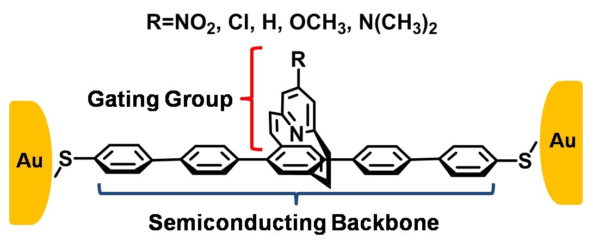
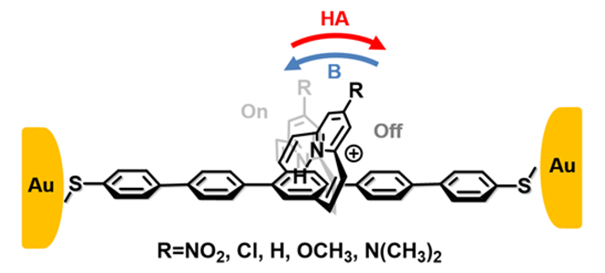

<body>

<b>Polymer Chemistry</b>

We are especially interested in exploring reactions that require mild reaction conditions for syntheses of functional polymers and materials. 

  1. Palladium-mediated coupling reactions (The Heck reaction, the Stille coupling reaction) for polycondensation; 
   
  2. Living ring-opening polymerization for the synthesis of biocompatible polyesters; 
   
  3. Exploring new polycondensation reactions (C-H bond activation reactions) as an alternative method to the Stille reaction; 
   
  4. Ladder polymer chemistry that allows syntheses of ladder types of heteroacenes and heterohelicenes. 

<b>Functional Materials</b>

  1. <b>Solar cell materials.</b> Our group is engaged in developing low bandgap materials that can efficiently harvest and convert solar energy into electricity. Two types of molecules are being designed and synthesized. a) p-Type low bandgap semiconducting polymers both linear and two-dimensional. b) n-Type semiconductors as electron-acceptors. We are developing state of art materials for both fundamental studies and device optimization. Extensive effort is devoted to the characterization of these new materials with regard to their structural and photophysical properties. In addition to designing functional materials, approaches to optimizing light conversion are pursued through device engineering and the optimization of processing conditions, including plasmonic enhancement of light absorption, nanotubes for increased charge transport, and ternary blend solar cells. 
   
  2. <b>Chiral polymers and heterohelicenes.</b> This project concerns the effect of chirality of polymers on their properties, such as electron-optic properties and self-assembly. 
   
  3. <b>Photocatalysts for water splitting based on functional poymers containing metal complexes and nanoporous polymers.</b> In addition to photovoltaics, one approach to convert sunlight into usable forms of energy, is to utilize solar energy to photo-catalytically convert inert chemicals, such as water and carbon dioxide, into energy-rich, storable chemical fuels. Light-induced splitting of water into oxygen and hydrogen is the most attractive approach not only because it can provide one potential solution to the world's ever-increasing energy demands, but also because the resulting fuel is environmentally benign. Our method toward this goal is the development of photocatalysts based on semiconducting polymers chelated with transition metals. In addition to their photocatalytic effect, we also study other physical properties of polymer metal complexes, such as photorefractive effects, photoconductivity, light emission and novel redox properties. These materials exhibit promising potential for applications in solar energy conversion as photocatalysts for water splitting and carbon dioxide reduction, sensors, polymer-supported electrodes, nonlinear optics, and electroluminescence. 
   
  4. <b>Materials for molecular electronics.</b> This project explores the power of organic chemistry in designing and synthesizing molecular electronic components, such as molecular diodes, molecular switches, and information storage material. A typical example is the demonstration of edge-on chemical gating effect in molecular wires utilizing the pyridinoparacyclophane moiety as the gate. The results show behavior similar to field-effect transistors. At the same time, protonation/deprotonation of the pyridine ring triggers a reversible alteration of the electrical properties of the molecular wire, leading to a binary on/off switch system. 
   
  
  

</body>